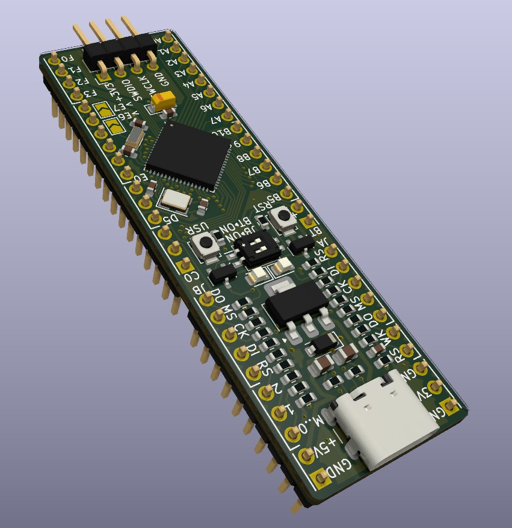
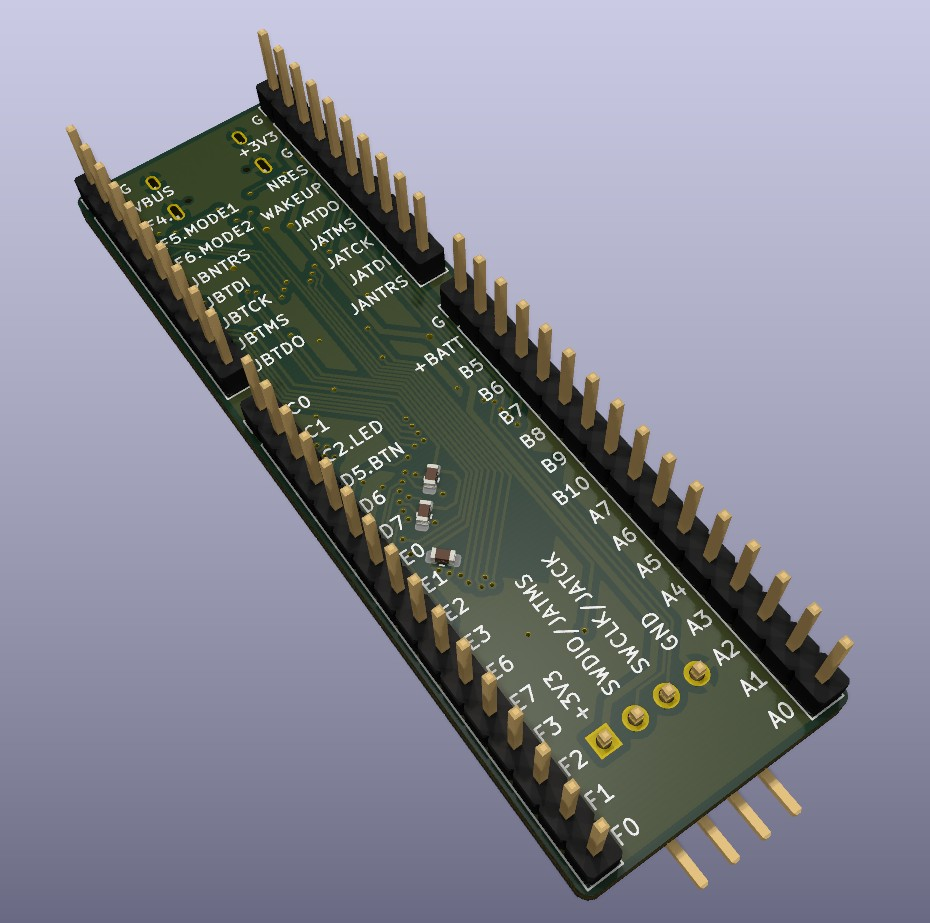
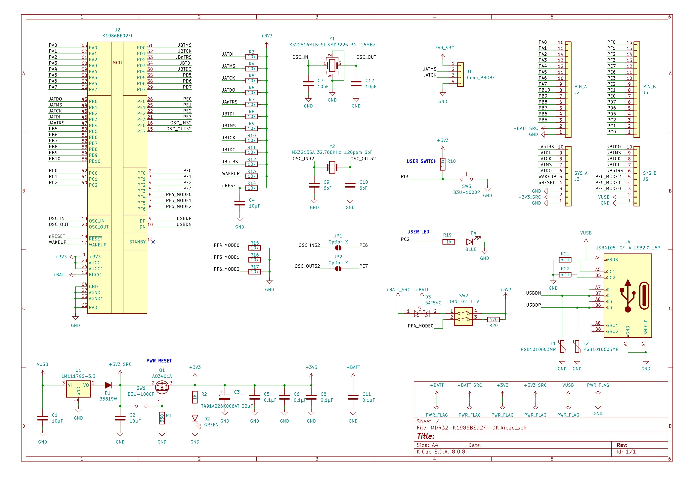
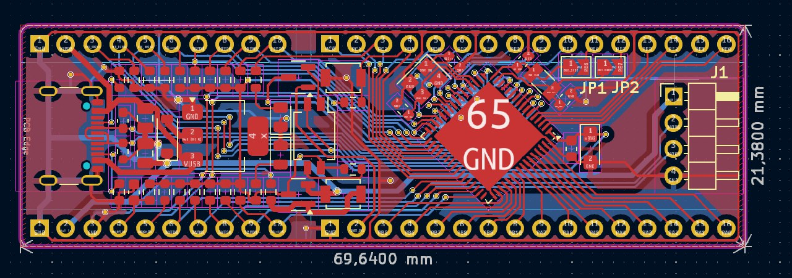
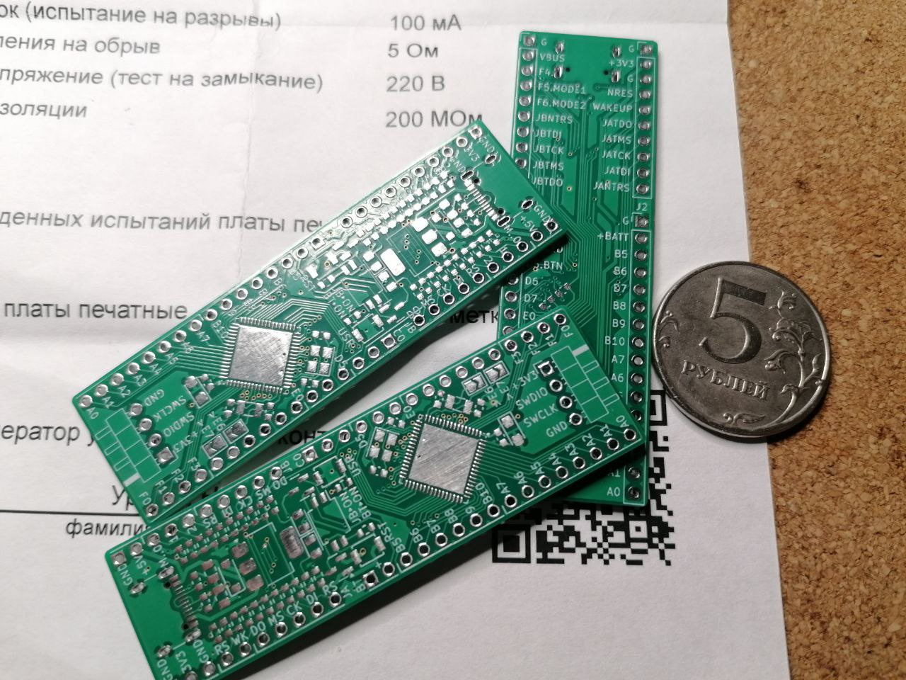
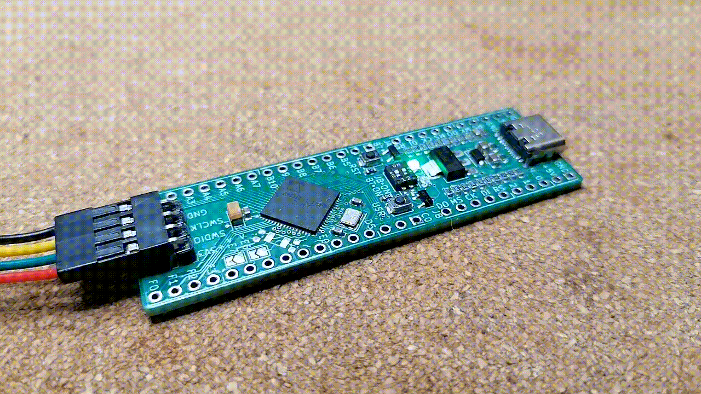

# MDR32-K1986BE92FI-DK (Doublemint) - Отладочная плата

Отладочная плата на микроконтроллере [K1986BE92FI](https://ic.milandr.ru/products/mikrokontrollery_i_protsessory/32_razryadnye_mikrokontrollery/k1986ve92fi) от компании [Milandr](https://milandr.ru/)

## Пользовательские элементы управления:

* `RST` - кнопка для сброса питания, осуществляет полное обесточивание всей цепи питания микроконтроллера, в т.ч. даже если питание платы осуществлено через `SWD`-коннектор программатора;
* `LED GREEN` - светодиод, сигнализирующий о наличии питания платы, *не имеет обозначения на плате*;
* `USR` - пользовательская кнопка, подключена к пину `PD5`;
* `LED BLUE` - пользовательский светодиод, подключен к пину `PC2`, *не имеет обозначения на плате*;

## Особенности

Плата выполнена только для внутренних целей, тестирования возможностей микроконтроллера и разработки модулей, т.е. широкопрофильна.

По вышеуказанным целя, плата имеет свои **особенности**:

* смотри на конденсаторы на второй стороне платы, размещаются максимально близко к пинам;

* присутствуют самовосстанавливаюшщиеся предохранители на линиях `D+` и `D-` данных `USB`;

* питание платы осуществляется от USB Type-C `5V DC` или от SWD-пинов `3.3V DC`;

* на плате предусмотрен линейный понижающий регулятор до `1А`, на случай если необходимо осуществить питание переферии от самой платы;

* перемычки пинов `PE6` и `PE7`, при замыкании которых будут использоваться именно эти пины вместо часового кварцевого резонатора на `32.768KHz` (соответственно, сам резонатор и его конденсаторы должны отсутствовать на плате);

* присутствует возможность пдключения батареи (при работе батареи необходимо перевести переключатель `BT > ON`. **Важно!** Переключение выполнить согласно шелкографии, а не обозначения на групповом переключателе);

* на штыревую гребенку выведены опциональные пины `MODE[0..1]` (пины `PF4-6`) режимов работы микроконтроллера, чтобы можно было ими манипулировать для целей разработки;

Также, плата имеет свои ограничения:
* разводка платы не расчитана на высокоскоростную работу с USB;
* нет разделения по аналоговому и общему питанию, поэтому работа с аналоговым сигналом не гарантирует правильную работу$
* `USB Type-C` используется только как `USB2.0`, настоен только на `5V DC`.

---

## Демо платы:

 

> [Смотреть схему в PDF-формате](./sch_MDR32-K1986BE92FI-DK.pdf)

